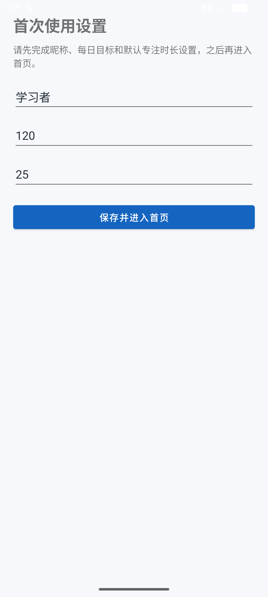
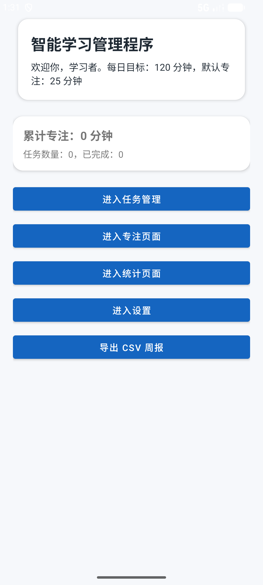
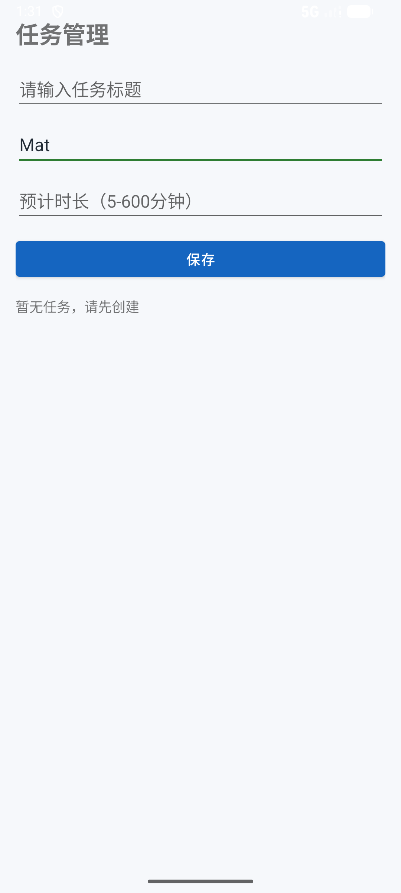
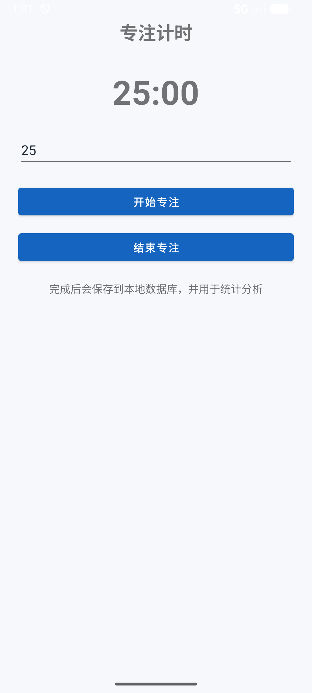
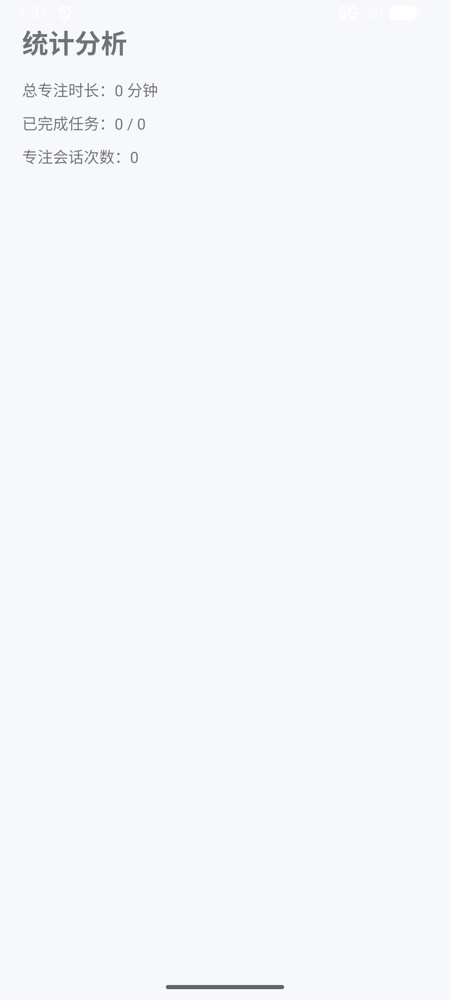
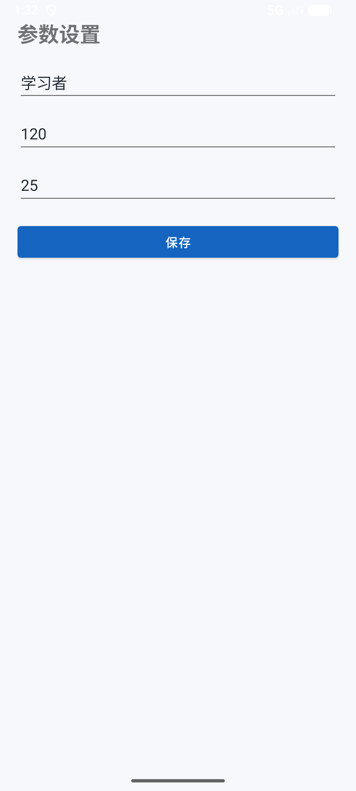

# 《Android开发技术》课程设计报告（最终提交版）

> 当前版本已补齐项目说明、技术实现、测试结果与真实运行截图。  
> 提交前仅需补充你的个人信息即可。

## 提交前待填写项

- 姓名
- 学号
- 班级
- 指导教师
- 完成时间

---

## 1. 课题名称

基于 Android 的智能学习管理程序设计与实现

## 2. 学生基本信息

- 姓名：【待填写】
- 学号：【待填写】
- 班级：【待填写】
- 指导教师：【待填写】
- 完成时间：【待填写】

## 3. 摘要

随着移动互联网和智能终端的普及，越来越多的学习任务和时间管理工作开始依赖手机应用完成。为了帮助学生更方便地管理学习任务、记录专注时间并查看学习统计数据，本文设计并实现了一个基于 Android 原生开发的智能学习管理程序。

本系统采用 Java 语言进行开发，界面层使用 Activity 和 XML 布局实现，轻量级配置信息通过 SharedPreferences 保存，任务数据与专注记录通过 SQLite 本地数据库管理。系统主要实现了首次引导、任务管理、专注计时、统计分析、参数设置和 CSV 导出等功能，能够完成“基础设置—任务执行—专注记录—统计展示—结果导出”的基本学习管理闭环。

在实现过程中，项目重点围绕原生 Android 技术路线展开，没有引入过多复杂框架，使系统结构更加清晰、页面跳转更直观、关键功能更便于说明。最终结果表明，该系统能够较好地满足课程设计对 Android 原生开发、数据库应用和综合功能实现的要求。

**关键词：** Android；Java；SQLite；SharedPreferences；专注计时；任务管理

## 4. 课题背景与问题分析

在日常学习过程中，学生通常会遇到以下问题：

1. 学习任务记录分散，容易遗漏或遗忘。
2. 学习时长难以量化，无法准确掌握专注情况。
3. 学习完成情况缺少数据汇总，不便于后续复盘和分析。
4. 基础学习数据无法方便导出，展示和保存都不够直观。

针对以上问题，本项目设计一个智能学习管理程序，帮助用户完成学习任务录入、专注时长统计和结果展示，从而提升学习计划的可执行性和可视化程度。

## 5. 需求分析

### 5.1 功能需求

系统需要具备以下核心功能：

1. 首次启动时进入引导页，完成昵称、每日目标和默认专注时长设置。
2. 支持新增学习任务，并查看任务列表。
3. 支持将任务标记为已完成。
4. 支持输入专注时长并开始倒计时。
5. 支持手动结束或自动完成专注，并保存专注记录。
6. 支持统计累计专注时长、任务完成数量和专注会话次数。
7. 支持修改昵称、每日目标和默认专注时长等基础设置。
8. 支持导出 CSV 文件，并通过系统分享面板发送。

### 5.2 非功能需求

除功能需求外，系统还应满足以下要求：

1. 页面结构清晰，便于老师检查 Activity 页面跳转关系。
2. 数据应保存在本地，保证离线情况下也能运行。
3. 关键流程要有输入合法性校验，避免明显错误输入。
4. 项目实现应尽量采用原生 Android 技术路线，符合课程考核口径。

## 6. 总体设计

### 6.1 技术路线

本系统采用以下技术方案：

1. 开发语言：Java
2. 页面结构：Activity
3. 界面实现：XML + ViewBinding
4. 列表展示：RecyclerView
5. 本地配置：SharedPreferences
6. 数据库存储：SQLiteOpenHelper + SQLite
7. 倒计时实现：CountDownTimer
8. 文件导出与分享：FileProvider + Intent.ACTION_SEND

### 6.2 系统功能结构

系统主要由以下模块组成：

1. 引导模块
2. 首页模块
3. 任务管理模块
4. 专注计时模块
5. 统计分析模块
6. 设置模块
7. CSV 导出模块

### 6.3 页面流程设计

系统页面流程如下：

1. 用户启动应用。
2. 系统判断用户是否已完成首次引导。
3. 若未完成，则进入引导页填写基础信息。
4. 保存基础信息后进入首页。
5. 用户可从首页进入任务管理、专注计时、统计分析和设置页面。
6. 用户也可以直接从首页导出 CSV 文件。

这一流程结构清晰，便于演示，也方便说明各页面之间的关系。

## 7. 数据库设计

### 7.1 数据表设计

系统使用 SQLite 保存核心业务数据，共设计两张数据表。

#### （1）study_task 表

用于保存学习任务数据，主要字段如下：

| 字段名 | 类型 | 含义 |
|---|---|---|
| id | INTEGER | 主键，自增 |
| title | TEXT | 任务标题 |
| category | TEXT | 任务分类 |
| estimated_minutes | INTEGER | 预计时长 |
| status | TEXT | 任务状态 |
| created_at | INTEGER | 创建时间 |

#### （2）focus_session 表

用于保存专注记录，主要字段如下：

| 字段名 | 类型 | 含义 |
|---|---|---|
| id | INTEGER | 主键，自增 |
| planned_minutes | INTEGER | 计划专注时长 |
| actual_minutes | INTEGER | 实际专注时长 |
| started_at | INTEGER | 开始时间 |
| ended_at | INTEGER | 结束时间 |

### 7.2 数据存储策略

系统中的数据分为两类：

1. 轻量级配置数据，例如是否完成引导、昵称、每日目标、默认专注时长，使用 SharedPreferences 保存。
2. 结构化业务数据，例如任务记录和专注记录，使用 SQLite 本地数据库保存。

这种设计可以让系统结构更加清晰，也便于分别说明不同数据的存储原因。

## 8. 详细功能设计与实现

### 8.1 首次引导模块

首次引导模块的主要作用是完成用户基础信息初始化。系统启动后，首页会先读取 SharedPreferences，判断用户是否完成过首次引导。如果未完成，则自动跳转到引导页。

在引导页中，用户需要输入昵称、每日目标分钟数和默认专注时长。系统会对这些输入进行非空校验和范围校验。输入合法后，系统调用偏好存储类保存数据，并跳转到首页。

该模块的关键函数包括：

1. `PreferenceManager.isOnboardingDone()`
2. `PreferenceManager.saveProfile(...)`
3. `OnboardingActivity.saveAndGoHome()`

### 8.2 首页模块

首页模块是系统的主入口页面，主要负责展示摘要信息和进行页面跳转。首页可以显示当前用户昵称、每日目标、默认专注时长、累计专注时长以及任务数量统计。

此外，首页还提供进入任务管理、专注计时、统计分析和设置页面的按钮，并提供 CSV 导出入口。

首页数据放在 `onResume()` 中刷新，这样用户从其他页面返回首页时，可以及时看到最新统计结果。

### 8.3 任务管理模块

任务管理模块用于实现任务的新增、查看和状态更新。用户输入任务标题、任务分类和预计时长后，系统先进行输入合法性校验，再调用数据库方法将任务保存到 `study_task` 表中。

任务列表通过 RecyclerView 进行展示，每个任务项都显示标题、分类、预计时长和状态。用户点击完成按钮后，系统会将对应任务状态更新为 `DONE`，并重新刷新列表。

该模块的关键函数包括：

1. `TaskActivity.saveTask()`
2. `TaskActivity.loadTasks()`
3. `TaskActivity.markTaskDone(...)`
4. `AppDatabaseHelper.insertTask(...)`
5. `AppDatabaseHelper.queryTasks()`
6. `AppDatabaseHelper.markTaskDone(...)`

### 8.4 专注计时模块

专注计时模块主要用于帮助用户记录一次完整的专注过程。用户输入专注时长后，系统会先进行合法性校验，再使用 CountDownTimer 开启倒计时。

在倒计时过程中，界面会每秒更新剩余时间。若用户手动结束专注，系统会按实际经过的时间计算专注分钟数；若倒计时自然结束，系统会直接按计划时长保存记录。保存后的记录会写入 `focus_session` 表，用于后续统计分析。

该模块的关键函数包括：

1. `FocusActivity.startFocus()`
2. `FocusActivity.startTimer()`
3. `FocusActivity.endFocus()`
4. `FocusActivity.saveSession(...)`
5. `AppDatabaseHelper.insertSession(...)`

### 8.5 统计分析模块

统计分析模块用于展示用户当前的学习数据汇总结果。为了避免在页面层做重复计算，系统将统计逻辑统一封装在数据库层，通过 SQL 聚合查询直接获取：

1. 总任务数
2. 已完成任务数
3. 专注会话次数
4. 累计专注时长

统计页每次进入时都重新读取数据库结果，保证显示内容与当前任务和专注记录一致。

该模块的关键函数包括：

1. `AppDatabaseHelper.querySummary()`
2. `StatsActivity.onResume()`

### 8.6 设置模块

设置模块用于修改用户基础参数，包括昵称、每日目标和默认专注时长。它与引导模块的区别在于：引导模块用于首次录入，设置模块用于后续修改。

保存设置时，系统同样会进行非空和范围校验，通过同一个偏好存储类统一保存，保证逻辑一致。

### 8.7 CSV 导出模块

CSV 导出模块的作用是将首页统计结果整理成文件，便于保存和展示。系统先根据首页摘要与统计数据拼接 CSV 文本，再将其写入本地导出目录。随后通过 FileProvider 获取可共享的 Uri，并调用系统分享面板发送文件。

该模块的关键函数包括：

1. `HomeActivity.exportCsv()`
2. `ExportUtils.exportSummaryCsv(...)`
3. `ExportUtils.createShareIntent(...)`

## 9. 系统测试与运行结果

### 9.1 测试内容

为了验证系统功能，本项目对以下流程进行了检查：

1. 首次启动是否进入引导页。
2. 引导页是否能够保存基础信息并进入首页。
3. 任务页是否能够新增任务并标记完成。
4. 专注页是否能够启动计时并保存记录。
5. 统计页是否能够正确显示汇总数据。
6. 设置页是否能够修改并保存用户参数。
7. 首页是否能够导出 CSV 并调起系统分享面板。

### 9.2 测试结果

经构建验证，当前主线已能够成功执行 `./gradlew :courseapp:assembleDebug` 并生成可安装的 Debug APK，说明项目具备正常构建能力。

在本地 Android 模拟器中完成实际安装与运行后，系统能够正常进入首次引导页，并在保存基础信息后进入首页。随后继续对任务管理、专注计时、统计分析和参数设置页面进行了实际界面检查，页面能够正常打开，核心展示信息与当前实现口径一致。

结合本轮真实运行结果，可以认为当前主线已具备“可构建、可启动、可演示”的基础条件，能够支撑课程设计汇报与答辩展示。

### 9.3 运行截图

以下截图均来自本地 Android 模拟器实际运行 `courseapp` 时获取，可作为本次课程设计的运行结果证明。

#### （1）首次使用引导页

#### （2）首页

#### （3）任务管理页

#### （4）专注计时页

#### （5）统计分析页

#### （6）参数设置页

#### （7）说明

由于本轮重点是验证页面流程与主要功能链路，CSV 导出分享面板截图暂未补充；如提交材料需要更完整展示，可在后续补拍并追加到本节。

## 10. 项目特色与创新点

本项目的特色主要体现在以下几个方面：

1. 采用 Java + Activity + XML 的原生 Android 技术路线，符合课程考核要求。
2. 使用 SQLite 完成真实的本地数据存储和统计分析，体现数据库应用能力。
3. 使用 CountDownTimer 实现专注计时，逻辑清晰，便于答辩说明。
4. 支持 CSV 导出，增强了系统展示性和完整性。
5. 页面结构简单直观，功能链路完整，便于现场演示。

## 11. 总结与展望

通过本次课程设计，我完成了一个基于 Android 原生开发的智能学习管理程序，实现了首次引导、任务管理、专注计时、统计分析、设置与 CSV 导出等功能。整个项目围绕课程要求展开，重点体现了原生页面开发、本地数据库应用和文件导出处理等核心知识点。

在开发过程中，我进一步掌握了 Activity 页面组织方式、XML 布局设计方法、SQLite 本地数据库操作流程以及 SharedPreferences 配置保存方法。同时，我也体会到在移动应用开发中，页面交互、数据存储和功能联动之间需要保持良好的结构设计。

当然，当前系统仍存在一定的可扩展空间，例如：

1. 增加任务编辑和删除功能。
2. 丰富统计维度，例如按日期统计专注数据。
3. 增加学习提醒功能，提高实用性。
4. 对页面视觉效果进一步优化。

总体来看，本项目已经较好地完成了课程设计目标，具备较好的完整性、可演示性和可答辩性。

## 12. 参考文献

1. Android Developers 官方文档
2. 《Android 程序设计》相关教材
3. SQLite 官方文档及相关学习资料

